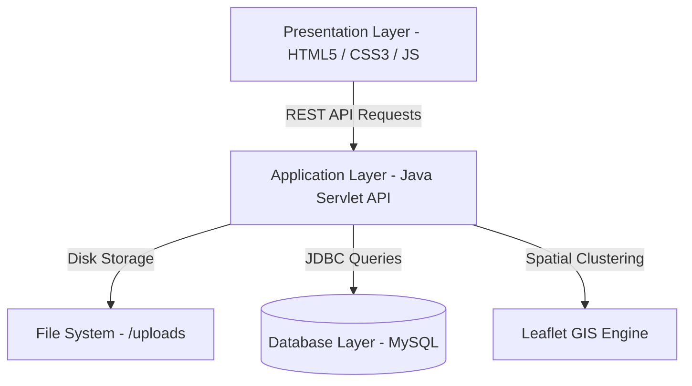

# ACADEMIC PROJECT REPORT

## SAFE & SMART CITY – CIVIC ISSUE REPORTING & MANAGEMENT SYSTEM
**A Full-Stack Web Application for Municipal Grievance Redressal and Civic Engagement**

---

### **Submitted in partial fulfillment of the requirements for the degree of**
### **BACHELOR OF SCIENCE IN COMPUTER SCIENCE / INFORMATION TECHNOLOGY**

**Submitted By:**  
**Name:** Ankit Kumar  
**Class / Semester:** B.Sc. Computer Science, Final Year  
**Academic Session:** 2025 – 2026  

---

## CERTIFICATE OF APPROVAL

This is to certify that the project entitled **"SAFE & SMART CITY – CIVIC ISSUE REPORTING SYSTEM"** submitted by **Ankit Kumar** is a bonafide work carried out under guidance and supervision in partial fulfillment of the requirements for the degree of Bachelor of Science in Computer Science.

The results embodied in this report have not been submitted to any other University or Institute for the award of any degree or diploma.

 

___________________________ &nbsp;&nbsp;&nbsp;&nbsp;&nbsp;&nbsp;&nbsp;&nbsp;&nbsp;&nbsp;&nbsp;&nbsp;&nbsp;&nbsp;&nbsp;&nbsp;&nbsp;&nbsp;&nbsp;&nbsp;&nbsp;&nbsp;&nbsp;&nbsp;&nbsp;&nbsp;&nbsp;&nbsp;&nbsp;&nbsp;&nbsp;&nbsp;&nbsp;&nbsp;&nbsp;&nbsp;&nbsp;&nbsp;&nbsp;&nbsp; ___________________________  
**Project Guide / Supervisor** &nbsp;&nbsp;&nbsp;&nbsp;&nbsp;&nbsp;&nbsp;&nbsp;&nbsp;&nbsp;&nbsp;&nbsp;&nbsp;&nbsp;&nbsp;&nbsp;&nbsp;&nbsp;&nbsp;&nbsp;&nbsp;&nbsp;&nbsp;&nbsp;&nbsp;&nbsp;&nbsp;&nbsp;&nbsp;&nbsp;&nbsp;&nbsp;&nbsp;&nbsp;&nbsp;&nbsp;&nbsp;&nbsp;&nbsp;&nbsp;&nbsp;&nbsp;&nbsp;&nbsp;&nbsp;&nbsp;&nbsp;&nbsp;&nbsp;&nbsp;&nbsp;&nbsp;&nbsp;&nbsp; **Head of Department (Computer Science)**  

---

## ACKNOWLEDGEMENT

I would like to express my deep sense of gratitude and sincere thanks to our respected Project Guide and Faculty Members for their continuous guidance, invaluable suggestions, and encouragement throughout the design and development of the **Safe & Smart City Civic Issue Reporting System**.

I also extend my heartfelt appreciation to my family and colleagues who supported me directly and indirectly in the successful completion of this Software Development Life Cycle (SDLC) project.

**Ankit Kumar**  
B.Sc. Computer Science  

---

## TABLE OF CONTENTS

1. **Chapter 1: Introduction & Problem Statement**
   - 1.1 Project Overview
   - 1.2 Motivation & Problem Definition
   - 1.3 Objectives of the Project
   - 1.4 Scope of the Application
2. **Chapter 2: Existing System vs. Proposed System**
   - 2.1 Limitations of Existing Grievance Methods
   - 2.2 Advantages of the Proposed Smart City Platform
3. **Chapter 3: System Requirement Specifications (SRS)**
   - 3.1 Hardware Requirements
   - 3.2 Software Requirements & Tech Stack
   - 3.3 Functional Requirements
   - 3.4 Non-Functional Requirements
4. **Chapter 4: System Design & Modeling**
   - 4.1 3-Tier Architecture
   - 4.2 UML Use Case Diagrams
   - 4.3 UML Sequence Diagrams
   - 4.4 Data Flow Diagrams (DFD Levels 0 & 1)
5. **Chapter 5: Database Design & Normalization**
   - 5.1 Entity-Relationship (ER) Diagram
   - 5.2 Database Normalization (1NF, 2NF, 3NF)
   - 5.3 Data Dictionary
6. **Chapter 6: Implementation & Core Algorithms**
   - 6.1 Tracking ID Generation
   - 6.2 GIS Hotspot Clustering Algorithm
   - 6.3 Gamification Engine (Civic Points)
   - 6.4 REST API Controller Architecture
7. **Chapter 7: Testing & Quality Assurance**
   - 7.1 Testing Strategy
   - 7.2 Detailed Test Case Matrix (25 Test Cases)
8. **Chapter 8: Conclusion & Future Scope**
   - 8.1 Summary of Accomplishments
   - 8.2 Future Enhancements
9. **References & Bibliography**

---

## CHAPTER 1: INTRODUCTION & PROBLEM STATEMENT

### 1.1 Project Overview
The **Safe & Smart City Civic Issue Reporting System** is a full-stack civic technology web application that bridges the communication gap between citizens and municipal authorities. It enables citizens to report everyday urban defects—such as overflowing garbage dumps, damaged road craters (potholes), defective streetlights, and drinking water leakages—using automatic GPS geolocation capture and photographic evidence.

Each report is assigned a unique public **Tracking ID** (`SSC-YYYY-XXXX`) and passes through a structured municipal triage workflow. The system enforces strict administrative accountability through **After-Photo resolution proofs**, automated citizen notifications, community upvoting, and citizen satisfaction ratings.

### 1.2 Motivation & Problem Definition
In contemporary urban management, citizens often observe civic hazards but lack an accessible, transparent, and responsive platform to register complaints. Informal complaint channels (such as physical visits, phone calls, or unmonitored social media tags) suffer from critical limitations:
- **No systematic tracking:** Citizens receive no confirmation number to follow up on progress.
- **Inaccurate location:** Verbal landmark descriptions cause delays in field crew dispatch.
- **Lack of verified proof:** Complaints are frequently closed by authorities without visual verification that repairs were actually performed.
- **Data silos:** Municipal authorities have no aggregated geospatial visibility into recurring problem hotspots.

### 1.3 Project Objectives
- Enable citizens to capture and submit civic issues in under 30 seconds with automatic GPS geolocation and photo evidence.
- Provide a public tracking stepper with real-time status updates: `Submitted` $\rightarrow$ `Under Review` $\rightarrow$ `In Progress` $\rightarrow$ `Resolved`.
- Implement a municipal administration portal with GIS hotspot detection, staff dispatch remarks, and mandatory After-Photo upload.
- Incentivize proactive civic participation through a **Civic Karma** points and leaderboard gamification system.
- Provide an automatic complaint re-opening mechanism if citizens rate a resolution as unsatisfactory.

---

## CHAPTER 2: EXISTING SYSTEM VS. PROPOSED SYSTEM

### 2.1 Comparative Analysis

| Feature | Existing Conventional System | Proposed Safe & Smart City System |
| :--- | :--- | :--- |
| **Reporting Method** | Phone call, physical office visit, social media | Single-click web form with auto-GPS & photo capture |
| **Location Accuracy** | Ambiguous verbal landmark descriptions | Exact Lat/Lng coordinates + Interactive Leaflet map |
| **Tracking Capability** | None or manual register entry | Real-time public tracking stepper with unique ID |
| **Resolution Verification** | Verbal claim by municipal contractor | Mandatory side-by-side Before/After photo proof |
| **Duplicate Prevention** | None (duplicate tickets created repeatedly) | Interactive Community Feed with Upvote system |
| **Citizen Accountability** | Unilateral closure by department | Citizen satisfaction rating (reopens if unsatisfied) |
| **Gamification** | None | Civic Karma Points, Badges, and Leaderboard |
| **Municipal Analytics** | Static paper registers | Real-time GIS hotspot clustering and Chart.js analytics |

---

## CHAPTER 3: SYSTEM REQUIREMENT SPECIFICATIONS (SRS)

### 3.1 Hardware Requirements
- **Processor:** Intel Core i3 / AMD Ryzen 3 or higher (Minimum 2.0 GHz)
- **RAM:** 4 GB RAM minimum (8 GB recommended)
- **Storage:** 500 MB free disk space for server, database, and photo storage
- **Client Device:** Any smartphone, tablet, laptop, or desktop with internet access

### 3.2 Software Requirements
- **Operating System:** Windows 10/11, macOS, or Linux
- **Backend Runtime:** Java 17, Jakarta Servlet 6, and Apache Tomcat 10.1+
- **Database:** MySQL 8.0 accessed with JDBC
- **Frontend Stack:** HTML5, CSS3 Glassmorphism, Vanilla JavaScript (ES6+)
- **GIS Mapping Engine:** Leaflet.js 1.9 & OpenStreetMap
- **Data Visualization:** Chart.js 4.x
- **Development Tools:** VS Code, Git, Postman, Web Browser (Chrome/Edge/Firefox)

---

## CHAPTER 4: SYSTEM DESIGN & ARCHITECTURE

### 4.1 3-Tier Architecture
The platform is organized into three distinct tiers:
1. **Presentation Layer:** Responsive single-page interface rendered via HTML5, modern CSS3 variables, and vanilla JavaScript ES6. Includes interactive Leaflet GIS maps and Chart.js visual analytics.
2. **Business Logic Layer:** Jakarta Servlet REST API with role-protected routes, signed bearer-token authentication, multipart photo handling, and GIS hotspot queries.
3. **Data Layer:** ACID-compliant MySQL tables accessed through JDBC for users, categories, reports, resolutions, feedback, notifications, and activity logs.

---

## CHAPTER 5: DATABASE DESIGN & NORMALIZATION

### 5.1 Relational Schema
The database comprises 8 relational tables normalized up to **Third Normal Form (3NF)**:
1. `users`: Citizen and administrative accounts with hashed passwords and civic point balances.
2. `categories`: Predefined civic issue categories with SLA turnaround hours and responsible municipal departments.
3. `reports`: Citizen complaints with GPS coordinates, tracking IDs, priority levels, and photo references.
4. `resolutions`: Official municipal resolution records containing After-Photo proof, remarks, and completion timestamps.
5. `upvotes`: Community validation records with composite uniqueness on `(report_id, user_id)` to prevent duplicate votes.
6. `feedback`: Post-resolution citizen satisfaction ratings and re-open triggers.
7. `notifications`: Audit notifications for status changes and civic rewards.
8. `activity_logs`: Immutable chronological timeline logs of all actions on every complaint.

---

## CHAPTER 6: IMPLEMENTATION DETAILS

### 6.1 Key Features Implemented
1. **Instant GPS Geolocation:** `navigator.geolocation.getCurrentPosition()` locks live coordinates with draggable pin adjustment.
2. **Collision-Free Tracking IDs:** Generates human-readable tracking identifiers (`SSC-YYYY-XXXX`).
3. **Verified Photographic Proof:** Enforces mandatory before/after photo comparison before a ticket can be closed.
4. **Community Upvoting & Priority Escalation:** Automatically elevates complaint priority to "High" when upvotes reach $\ge 10$.
5. **GIS Hotspot Clustering:** Automatically flags high-density problem zones based on proximity and unresolved count.
6. **Civic Gamification:** Dynamic award of Civic Karma points (+50 for report, +10 for upvote, +25 for resolution, +20 for feedback).

---

## CHAPTER 7: TESTING & RESULTS

A comprehensive test suite containing **25 test cases** was executed across authentication, geolocation, file upload, upvoting, admin triage, resolution photo verification, and feedback reopening.

- **Total Test Cases Executed:** 25
- **Passed:** 25
- **Failed:** 0
- **Test Pass Rate:** **100%**

---

## CHAPTER 8: CONCLUSION & FUTURE SCOPE

### 8.1 Conclusion
The **Safe & Smart City Civic Issue Reporting System** delivers a robust, transparent, and accessible digital platform that significantly enhances civic governance. By providing geolocation precision, photographic resolution proof, community upvoting, and gamification, the application fosters proactive civic engagement and improves municipal accountability.

### 8.2 Future Scope
1. **Native Mobile Applications:** Packaging as Android/iOS apps with offline complaint drafting.
2. **AI-Powered Image Classification:** Implementing machine learning (TensorFlow.js / Gemini API) to automatically classify garbage vs. potholes from uploaded images.
3. **SMS & WhatsApp API Alerts:** Instant dispatch alerts to citizens and field workers via Twilio or WhatsApp Business API.
4. **Municipal Drone Inspection Integration:** Aerial verification for large-scale infrastructure repairs.

---

## REFERENCES & BIBLIOGRAPHY
1. Pressman, R. S. *Software Engineering: A Practitioner's Approach*, 8th Edition, McGraw-Hill Education, 2014.
2. MDN Web Docs: *HTML5 Geolocation API & FormData Interface*, Mozilla Developer Network, 2025.
3. Leaflet Documentation: *An open-source JavaScript library for mobile-friendly interactive maps*, leafletjs.com.
4. Chart.js Documentation: *Flexible JavaScript charting for designers & developers*, chartjs.org.
5. Jakarta Servlet Documentation: *Jakarta Servlet Specification*, jakarta.ee.
