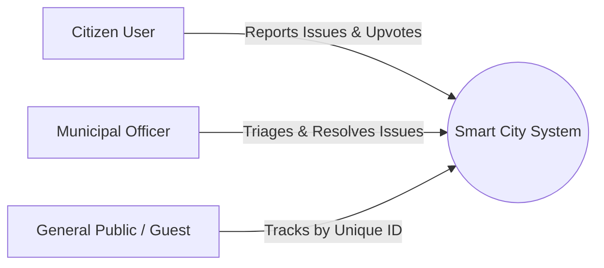

# Software Development Life Cycle (SDLC)
## Phase 1: Requirement Analysis & Software Requirement Specification (SRS)

**Project Title:** Safe & Smart City – Civic Issue Reporting & Management System  
**Academic Level:** B.Sc. Computer Science / Engineering Mini Project  
**Author / Developer:** Ankit Kumar  

---

### 1. Introduction & Background
In urban environments across India, citizens routinely encounter civic problems such as garbage accumulation, damaged road surfaces (potholes), non-functional streetlights, open sewage overflows, and clean water pipeline bursts. 

Traditionally, municipal grievance redressal has suffered from significant structural bottlenecks:
1. **Informal & Untracked Channels:** Complaints made via phone calls, physical visits, or social media posts lack centralized tracking numbers.
2. **Ambiguous Location Data:** Verbal or typed street descriptions are often imprecise, delaying field maintenance crews.
3. **Lack of Resolution Accountability:** Citizens are rarely notified of work status and have no photographic evidence to verify that problems were genuinely resolved.
4. **Absence of Data-Driven Planning:** Municipal administrators have no unified GIS hotspot data to identify recurring problem zones.

The **Safe & Smart City Platform** addresses these challenges by introducing an end-to-end digital workflow with automatic GPS geolocation capture, multipart photo evidence, unique tracking IDs, community upvoting, and citizen satisfaction ratings.

---

### 2. Feasibility Study

| Dimension | Analysis & Findings | Feasibility Outcome |
| :--- | :--- | :--- |
| **Technical Feasibility** | Modern web browsers universally support HTML5 Geolocation, Leaflet OpenStreetMap tiles, and multipart FormData photo uploads without requiring native mobile installation. | **Highly Feasible** |
| **Operational Feasibility** | Municipal staff can operate the admin dashboard with minimal training. Citizens can report issues in under 30 seconds. | **Highly Feasible** |
| **Economic Feasibility** | Built using open-source Java, Jakarta Servlet, JDBC, MySQL, Leaflet, and Chart.js technologies. | **Highly Feasible** |
| **Schedule Feasibility** | Developed systematically following SDLC Agile/Iterative cycles. | **Highly Feasible** |

---

### 3. User Personas & Stakeholder Analysis

1. **Citizen User:**
   - **Goal:** Quickly capture a civic defect with photo and GPS, receive a tracking ID, and monitor resolution progress.
   - **Motivator:** Civic karma points and tangible community improvements.
2. **Municipal Administrator / Ward Engineer:**
   - **Goal:** View incoming complaints categorized by ward and urgency, assign field crews, and upload verified After-Photo proofs upon completion.
   - **Motivator:** Improved SLA adherence and ward performance metrics.
3. **General Public / Auditor:**
   - **Goal:** Transparently inspect any complaint by Tracking ID without mandatory login.

---

### 4. Functional Requirements (FR)

- **FR-1: Citizen Registration & Secure Authentication**
  - Secure signup with Name, Email, Phone, Ward, and Bcrypt-encrypted password.
  - Expiring signed bearer-token authentication for role-based access.
  - Initial award of 50 Civic Karma Points upon account registration.

- **FR-2: Issue Ingestion with Auto-Geolocation & Photo Capture**
  - Selection from standardized civic categories (Solid Waste, Roads, Lighting, Water, Drainage, Hygiene, Footpath).
  - One-click live GPS coordinate lock (`navigator.geolocation`) with interactive draggable Leaflet map fallback.
  - Multipart photographic evidence upload (Before-Photo).
  - Instant generation of formatted unique Tracking ID (`SSC-YYYY-XXXX`).

- **FR-3: Public Tracking & Status Stepper**
  - Public search bar accepting Tracking ID.
  - Visual 4-stage stepper: `Submitted` $\rightarrow$ `Under Review` $\rightarrow$ `In Progress` $\rightarrow$ `Resolved`.
  - Side-by-side Before vs After photographic proof comparison.
  - Official resolution remarks, action taken, and timestamp.

- **FR-4: Community Validation & Upvote System**
  - Citizens can browse neighborhood issues and click "Upvote" instead of submitting duplicate tickets.
  - A report matching an active issue in the same ward/category within 500 metres is linked to that issue; a new ticket is not created.
  - Upvoting awards +10 Civic Karma Points to the citizen.
  - Issues with $\ge 10$ upvotes are automatically elevated to `High Priority`.

- **FR-5: Citizen Feedback & Re-opening Mechanism**
  - Post-resolution 5-star rating and satisfaction verification.
  - If citizen marks **"Not Satisfied"**, the issue is automatically reopened to `In Progress` and escalated to municipal supervisors.
  - Satisfied feedback awards +20 Civic Points.

- **FR-6: Municipal Admin Command Center & GIS Hotspots**
  - Real-time KPI counters (Total, Pending, In Progress, Resolved, Critical Hotspots, Resolution Rate).
  - Auto-clustering GIS algorithm identifying high-density complaint clusters per ward.
  - Issue status transitions (`Pending` $\rightarrow$ `In Progress` $\rightarrow$ `Resolved`).
  - Resolution modal requiring mandatory **After-Photo** proof upload and official remarks.

- **FR-7: Real-Time Notifications & Gamification Leaderboard**
  - Notification alerts on status transitions, administrative remarks, and points earned.
  - An open tracking view refreshes its status and resolution evidence from the server every 10 seconds.
  - Public leaderboard ranking top civic champions with civic badges (👑 Grand Champion, 🥈 Eco Guardian, etc.).

---

### 5. Non-Functional Requirements (NFR)

- **NFR-1: Performance & Response Time**
  - Page load time $< 1.5$ seconds; REST API response time $< 150$ milliseconds.
- **NFR-2: Security & Privacy**
  - Password hashing with Bcrypt (salt rounds $= 10$).
  - Signed bearer authentication tokens with expiration.
  - Sanitization of user input against XSS and SQL Injection.
- **NFR-3: Usability & Responsiveness**
  - Glassmorphic, modern responsive UI supporting Mobile, Tablet, and Desktop screen widths ($320\text{px}$ to $2560\text{px}$).
- **NFR-4: Maintainability & Modularity**
  - Clean separation of Presentation (HTML/CSS/JS), Business Logic (Java Servlets/DAOs), and Data Storage (MySQL).

---

### 6. Summary of Phase 1 Deliverables
The Requirement Analysis phase establishes a concrete, testable specification for the Safe & Smart City application. All functional requirements have been mapped to specific system modules and API endpoints in subsequent design phases.
