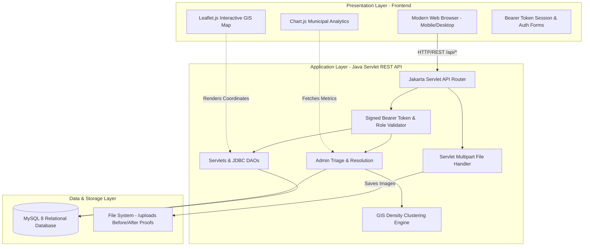
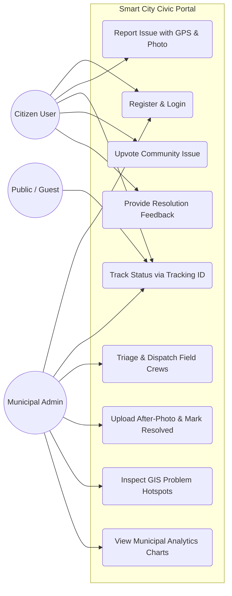
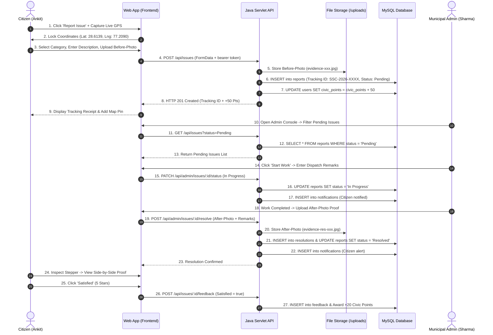
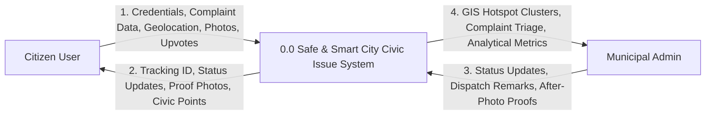
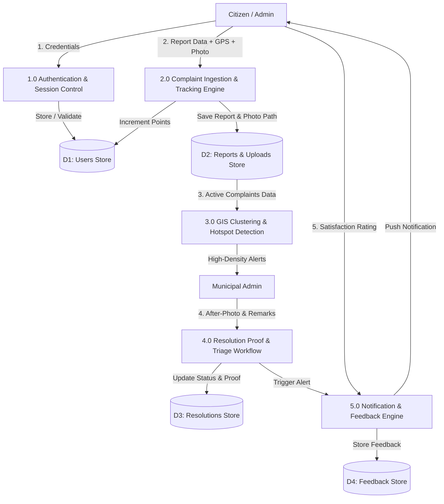

# Software Development Life Cycle (SDLC)
## Phase 2: System Architecture, UML Modeling & Data Flow Diagrams (DFD)

**Project Title:** Safe & Smart City – Civic Issue Reporting & Management System  
**Academic Level:** B.Sc. Computer Science / Engineering Mini Project  

---

### 1. High-Level 3-Tier System Architecture

The application adopts a decoupled 3-tier architecture ensuring scalability, separation of concerns, and security.

---

### 2. UML Use Case Diagram

---

### 3. UML Sequence Diagram: End-to-End Civic Reporting & Resolution Workflow

---

### 4. Data Flow Diagrams (DFD)

#### 4.1 DFD Level 0 (Context Diagram)

#### 4.2 DFD Level 1 (Decomposition Diagram)

---

### 5. Summary of Phase 2 Deliverables
The System Design phase provides full architectural blueprinting, interaction modeling, and data flow pipelines, establishing the structural basis for database implementation and coding.
