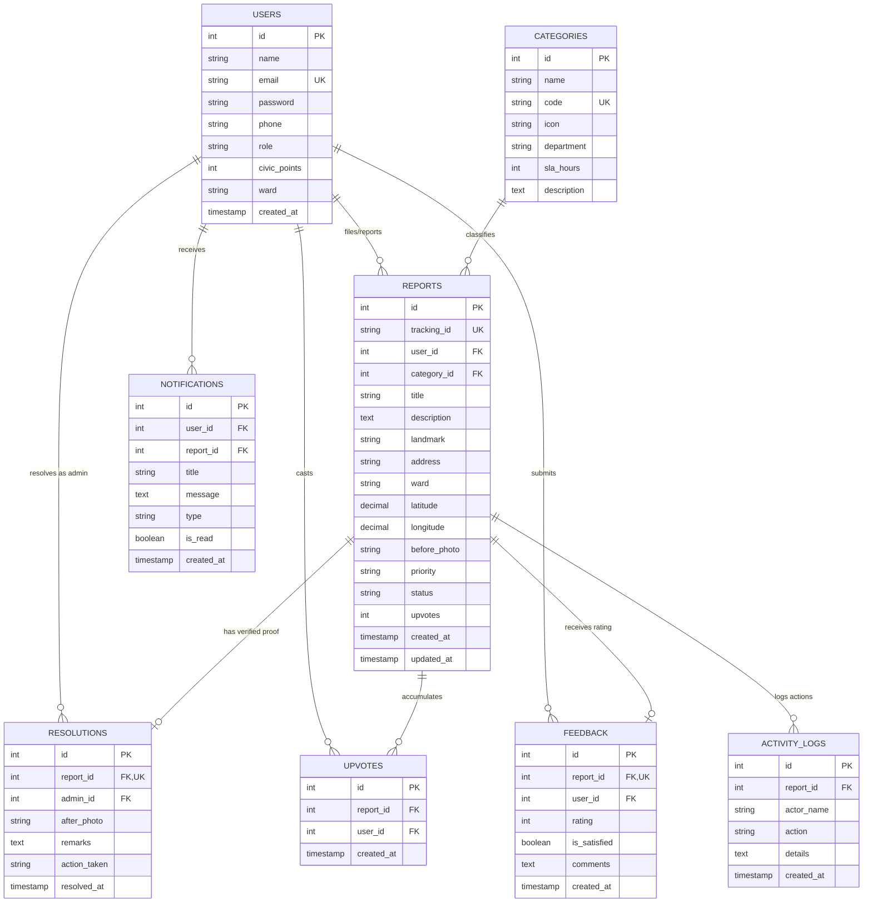

# Software Development Life Cycle (SDLC)
## Phase 3: Database Design, ER Modeling & Data Dictionary

**Project Title:** Safe & Smart City – Civic Issue Reporting & Management System  
**Academic Level:** B.Sc. Computer Science / Engineering Mini Project  

---

### 1. Entity-Relationship (ER) Diagram

---

### 2. Database Normalization Analysis

#### 2.1 First Normal Form (1NF)
- All table attributes contain **atomic (indivisible) values**.
- There are no repeating groups or multivalued attributes.
- Each table has a defined primary key (`id`).

#### 2.2 Second Normal Form (2NF)
- The database is in 1NF.
- All non-key attributes are fully functionally dependent on the entire primary key (no partial dependencies).
- Junction tables (such as `upvotes`) maintain foreign keys referencing the single surrogate key of parent tables.

#### 2.3 Third Normal Form (3NF)
- The database is in 2NF.
- There are no **transitive dependencies** ($X \rightarrow Y$ and $Y \rightarrow Z$).
- Department names and SLA hours are decoupled into the `categories` table rather than being redundantly duplicated in every row of `reports`.
- Resolution details (remarks, after-photo) reside in a separate `resolutions` entity, ensuring reports can exist independently in Pending/In Progress states without carrying null resolution attributes.

---

### 3. Data Dictionary

#### 3.1 Table: `users`
| Column Name | Data Type | Constraints | Description |
| :--- | :--- | :--- | :--- |
| `id` | INT / INTEGER | PK, Auto Increment | Unique internal identifier for the user |
| `name` | VARCHAR(100) | NOT NULL | Full name of the citizen or officer |
| `email` | VARCHAR(150) | NOT NULL, UNIQUE | Primary login email address |
| `password` | VARCHAR(255) | NOT NULL | Bcrypt salted hash of the password |
| `phone` | VARCHAR(20) | NULL | Contact mobile number |
| `role` | ENUM / TEXT | DEFAULT 'citizen' | User role: `'citizen'`, `'admin'`, or `'officer'` |
| `civic_points` | INT | DEFAULT 50 | Gamified civic karma score balance |
| `ward` | VARCHAR(100) | DEFAULT 'Ward 12' | Primary municipal ward of residence |
| `created_at` | TIMESTAMP | DEFAULT CURRENT_TIMESTAMP | Account creation datetime |

#### 3.2 Table: `categories`
| Column Name | Data Type | Constraints | Description |
| :--- | :--- | :--- | :--- |
| `id` | INT / INTEGER | PK, Auto Increment | Unique category ID |
| `name` | VARCHAR(100) | NOT NULL | Display name of civic category |
| `code` | VARCHAR(50) | NOT NULL, UNIQUE | System code (e.g. `'GARBAGE'`, `'ROADS'`) |
| `icon` | VARCHAR(50) | NOT NULL | FontAwesome icon class |
| `department` | VARCHAR(100) | NOT NULL | Responsible municipal department |
| `sla_hours` | INT | DEFAULT 48 | Standard resolution turnaround SLA in hours |
| `description` | TEXT | NULL | Detailed guidelines on what falls in category |

#### 3.3 Table: `reports`
| Column Name | Data Type | Constraints | Description |
| :--- | :--- | :--- | :--- |
| `id` | INT / INTEGER | PK, Auto Increment | Unique internal report ID |
| `tracking_id` | VARCHAR(50) | NOT NULL, UNIQUE | Public tracking identifier (`SSC-YYYY-XXXX`) |
| `user_id` | INT / INTEGER | FK $\rightarrow$ `users(id)` | ID of citizen who submitted complaint |
| `category_id` | INT / INTEGER | FK $\rightarrow$ `categories(id)` | Problem category reference |
| `title` | VARCHAR(200) | NOT NULL | Brief summary of the complaint |
| `description` | TEXT | NOT NULL | Detailed description of the defect |
| `landmark` | VARCHAR(200) | NULL | Nearby landmark or street name |
| `address` | VARCHAR(255) | NULL | Reverse-geocoded or entered address |
| `ward` | VARCHAR(100) | NOT NULL | Municipal ward territory |
| `latitude` | DECIMAL(10,7) | NOT NULL | GPS latitude coordinate |
| `longitude` | DECIMAL(10,7) | NOT NULL | GPS longitude coordinate |
| `before_photo` | VARCHAR(255) | NULL | Uploaded before-evidence image filename |
| `priority` | ENUM / TEXT | DEFAULT 'Medium' | Severity: `'Low'`, `'Medium'`, `'High'`, `'Critical'` |
| `status` | ENUM / TEXT | DEFAULT 'Pending' | Lifecycle: `'Pending'`, `'In Progress'`, `'Resolved'` |
| `upvotes` | INT | DEFAULT 1 | Cumulative citizen upvotes |
| `created_at` | TIMESTAMP | DEFAULT CURRENT_TIMESTAMP | Submission timestamp |
| `updated_at` | TIMESTAMP | DEFAULT CURRENT_TIMESTAMP | Last modification timestamp |

#### 3.4 Table: `resolutions`
| Column Name | Data Type | Constraints | Description |
| :--- | :--- | :--- | :--- |
| `id` | INT / INTEGER | PK, Auto Increment | Unique resolution ID |
| `report_id` | INT / INTEGER | FK, UNIQUE $\rightarrow$ `reports(id)` | Reference to resolved complaint |
| `admin_id` | INT / INTEGER | FK $\rightarrow$ `users(id)` | Officer who completed resolution |
| `after_photo` | VARCHAR(255) | NOT NULL | Photographic proof of completed work |
| `remarks` | TEXT | NOT NULL | Official municipal resolution remarks |
| `action_taken` | VARCHAR(200) | DEFAULT 'Site Rectified' | Brief label of maintenance action |
| `resolved_at` | TIMESTAMP | DEFAULT CURRENT_TIMESTAMP | Time of resolution verification |

#### 3.5 Table: `feedback`
| Column Name | Data Type | Constraints | Description |
| :--- | :--- | :--- | :--- |
| `id` | INT / INTEGER | PK, Auto Increment | Unique feedback ID |
| `report_id` | INT / INTEGER | FK, UNIQUE $\rightarrow$ `reports(id)` | Reference to resolved report |
| `user_id` | INT / INTEGER | FK $\rightarrow$ `users(id)` | Citizen providing feedback |
| `rating` | INT | CHECK (1 TO 5) | Star rating (1 to 5) |
| `is_satisfied` | BOOLEAN / INT | NOT NULL (1 or 0) | Satisfied flag; if 0, reopens issue |
| `comments` | TEXT | NULL | Qualitative remarks from citizen |
| `created_at` | TIMESTAMP | DEFAULT CURRENT_TIMESTAMP | Feedback timestamp |

---

### 4. Summary of Phase 3 Deliverables
The Database Design phase ensures strict relational integrity, zero redundant data duplication through 3NF normalization, comprehensive foreign key constraints, and fast query execution via indexing.
