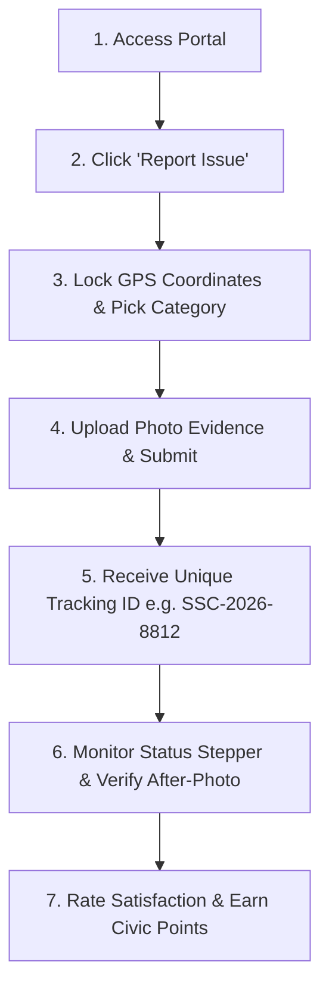

# Software Development Life Cycle (SDLC)
## Phase 6: Deployment, User Manual & Viva Voce Guide

**Project Title:** Safe & Smart City – Civic Issue Reporting & Management System  
**Academic Level:** B.Sc. Computer Science / Engineering Mini Project  

---

### 1. Installation & Deployment Guide

#### 1.1 Prerequisites
Ensure the target system has the following runtimes installed:
- **JDK:** 17 or above
- **Apache Tomcat:** 10.1 or above
- **MySQL Server:** 8.0 or above
- **Maven:** 3.8 or above (to build from source)
- **Web Browser:** Modern browser with Geolocation & ES6 support (Google Chrome, Microsoft Edge, Mozilla Firefox, or Safari)

#### 1.2 Step-by-Step Setup Instructions

```powershell
# Create the database once in MySQL
mysql -u root -p -e "CREATE DATABASE smart_city_db CHARACTER SET utf8mb4 COLLATE utf8mb4_unicode_ci;"

# Configure credentials for the Tomcat process
$env:SMARTCITY_DB_URL = 'jdbc:mysql://localhost:3306/smart_city_db?useSSL=false&serverTimezone=Asia/Kolkata&allowPublicKeyRetrieval=true'
$env:SMARTCITY_DB_USER = 'root'
$env:SMARTCITY_DB_PASSWORD = 'your-mysql-password'

# Build from the repository root and deploy to Tomcat
mvn -f .\SmartCityJava\pom.xml clean package
Copy-Item .\SmartCityJava\target\SmartCity.war C:\path\to\tomcat\webapps\
```

Start Tomcat and open **`http://localhost:8080/SmartCity/`**. On first start, the application initializes the MySQL tables and seeds the report categories.

---

### 2. Default Demonstration User Credentials

| User Type | Full Name / Title | Email Address | Password | Role / Access |
| :--- | :--- | :--- | :--- | :--- |
| **Municipal Admin (Demo)** | Demo Municipal Admin | `admin@example.test` | `admin123` | Full Admin & Triage Console |
| **Citizen (Demo 1)** | Demo Citizen One | `citizen.one@example.test` | `citizen123` | Citizen Reporting & Tracking |
| **Citizen (Demo 2)** | Demo Citizen Two | `citizen.two@example.test` | `citizen123` | Citizen Reporting & Tracking |

> **Security:** These accounts are intended only for a fresh local demonstration database. Change their passwords before any shared deployment.

The application seeds demo accounts only when the users table is empty. The listed passwords are demonstration defaults, not suitable for a public deployment.

---

### 3. Citizen User Manual



1. **Reporting an Issue:**
   - Click the green **"Report Issue"** button in the header.
   - Click **"Auto-Detect Live GPS"** to automatically lock the exact coordinates (or click/drag on the interactive picker map).
   - Select the problem category (e.g. Garbage, Roads, Streetlight, Water).
   - Add a short title, description, and landmark.
   - Attach a photographic proof and click **"Submit Civic Report"**.
   - Your unique Tracking ID (e.g. `SSC-2026-8812`) is displayed and 50 points are credited.

2. **Tracking an Issue:**
   - Enter your Tracking ID into the **Quick Complaint Tracker** on the home page.
   - View the 4-stage stepper (`Submitted` $\rightarrow$ `Under Review` $\rightarrow$ `In Progress` $\rightarrow$ `Resolved`).
   - Inspect the side-by-side Before and After photo comparison with official resolution remarks.

3. **Community Upvoting & Feed:**
   - Browse the community issue grid. Click the **"👍 Upvote"** button on neighbor complaints to increase priority without creating duplicate reports.

4. **Resolution Feedback:**
   - Once marked Resolved, rate satisfaction (5 Stars = Satisfied; Not Satisfied = Reopens issue for municipal inspection).

---

### 4. Municipal Administrator Manual

1. **Accessing Admin Console:**
   - Login using `admin@example.test` / `admin123`.
   - Click on the **"Admin Console"** tab in the navigation bar.

2. **Monitoring KPIs & Hotspots:**
   - Check real-time KPI cards (Pending Triage, In Progress, Resolved, Overall Resolution Rate).
   - Review the **GIS Problem Hotspots** grid to identify wards with clustered complaints.

3. **Triage & Status Transitions:**
   - Locate pending complaints in the Triage table.
   - Click **"Start Work"** and enter field dispatch remarks $\rightarrow$ Status changes to `In Progress` and the citizen is notified.

4. **Resolution with Verified Proof:**
   - Once field maintenance is completed, click **"Upload Proof & Resolve"**.
   - Enter the action taken summary, official remarks, and upload the mandatory **After-Photo Proof**.
   - Click **"Complete Resolution"** $\rightarrow$ Status is updated to `Resolved`, bonus points are awarded to the citizen, and an automated resolution alert is sent.

---

### 5. Viva Voce Frequently Asked Questions (Q&A)

**Q1: What is the main objective of the Safe & Smart City Project?**  
*Answer:* To bridge the communication gap between citizens and municipal authorities by providing a centralized, transparent, and location-aware web platform for reporting and resolving civic issues with verifiable photographic proof.

**Q2: Why is HTML5 Geolocation API used instead of manual text address entry?**  
*Answer:* Manual street typing often contains spelling discrepancies and ambiguous landmarks. Automatic GPS coordinates ensure exact GIS pinpointing on municipal maps and enable automated GIS hotspot cluster detection.

**Q3: How does the system handle photo evidence uploads?**  
*Answer:* Photos are received by the Servlet multipart API, validated for supported image types and size, stored under the deployed application's uploads directory, and referenced by the report or resolution record.

**Q4: How does the upvote mechanism benefit municipal operations?**  
*Answer:* When multiple citizens notice the same pothole or garbage dump, upvoting allows them to validate the existing ticket instead of creating duplicates. When upvotes reach $\ge 10$, the system automatically elevates the priority to "High".

**Q5: What happens if a citizen is not satisfied with a resolution?**  
*Answer:* The citizen can click "Not Satisfied" on the tracking page. The system immediately reopens the complaint back to `In Progress`, records the citizen's grievance in the audit log, and alerts municipal supervisors for secondary inspection.

**Q6: What database design choices were made for scalability?**  
*Answer:* MySQL foreign keys maintain referential integrity, and a composite unique key on `(report_id, user_id)` prevents duplicate upvoting. JDBC DAOs use parameterized SQL.
